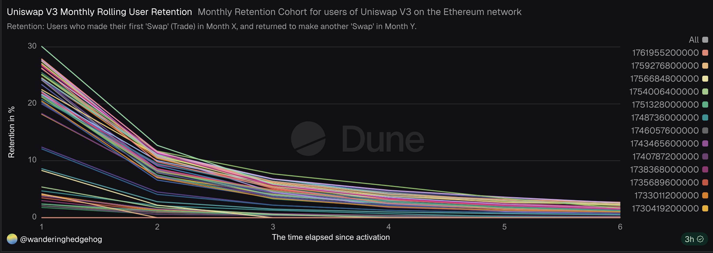

# Uniswap V3: Trader Retention Analysis (SQL Case Study)

This project is an advanced SQL case study focused on measuring user stickiness and health on the Uniswap V3 Decentralized Exchange (DEX) on the Ethereum network.

It specifically calculates monthly cohort rolling retention for unique traders based on their first interaction date.

# 1. Project Goal & Methodology

The primary goal was to measure and analyze how quickly new users (traders) abandon the Uniswap V3 protocol versus how many remain to form a core user base.

**Analysis Period Context**

* **Start Date (Earliest Cohort):** May 2021

* **Latest Cohort Observed:** November 2025 (The latest month available in the query)

* **Total Observation Window:** 55 months

* **Retention Metric:** Rolling Retention (M0 through M6)

**Metric Definitions**

1. **Trader:** A trader is defined as any wallet address that executes a Swap transaction on a Uniswap V3 pool.

2. **Cohort Identification:** Each trader is assigned to a monthly cohort based on the first-ever month they executed a Swap (Month 0).

3. **Retention Measurement:** Retention is tracked over a 7-month observation period (Month 0 to Month 6) by counting how many traders from the initial cohort were active in all subsequent months within that period (i.e., Rolling Retention).

# 2. SQL Query

The complete, heavily commented query used to extract the retention data is available in the retention_cohort_analysis.sql file. It uses advanced window functions, CTEs (Common Table Expressions), and conditional aggregation to pivot the retention data into the final cohort table format.

The analysis was performed on Dune Analytics using public Ethereum blockchain data.

# 3. Visualization: Monthly Retention Chart

The data demonstrates a classic retention decay curve, with a few notable behaviors specific to DeFi users.

**Live Links (Dune Analytics)**

To view the raw data table and interact with the live chart, please use the links below:

* [View Live Dune Query Results](https://dune.com/queries/6157015/9842401/)

* [Direct Link to Retention Chart](https://dune.com/embeds/6157015/9842401/)

# 4. Key Findings & Conclusion

Based on the visual decay of the lines in the chart and the underlying cohort data, the following key behavioral patterns were observed:

* **Extreme Front-Loaded Churn:** The chart clearly shows a massive drop-off for nearly every cohort between the initial month of activity (M0) and Month 1 (M1). Retention rates typically settle in the 10%–15% range at M1, indicating that the vast majority of traders are short-term or opportunistic users.

* **Strong Core User Base:** While initial drop-off is severe, the decay rate of the lines slows significantly after M2. This suggests that the small percentage of traders who return after the first two months form a loyal, core user base. This group exhibits high stickiness and is crucial for the long-term health of the protocol.

* **Seasonal Volatility Reflected:** Cohorts launched during market volatility or bull runs (which tend to be much larger) often demonstrate a lower retention floor, visually appearing as lines that decay more rapidly or bottom out sooner than those from periods of stable, organic growth.

The analysis highlights that efforts to improve retention should be focused not on preventing the initial M0-M1 drop (which is typical for DeFi), but on converting M1 and M2 users into the highly valuable M3+ core user group.
